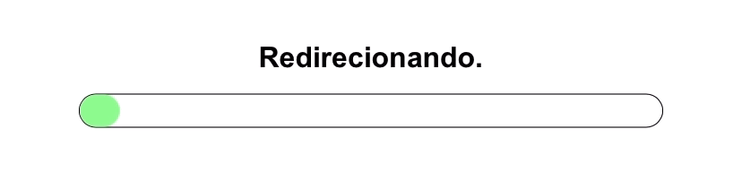

<h1 align="center">Sobre o repositório</h1>

Nesse repositório tem algumas telas de carregamento e redirecionamento

 

 

<h3 align="center">Linguagens usadas</h3>

 

 
 

<a href="https://marcoseduardo.dev.br">eduardoc126</a>

